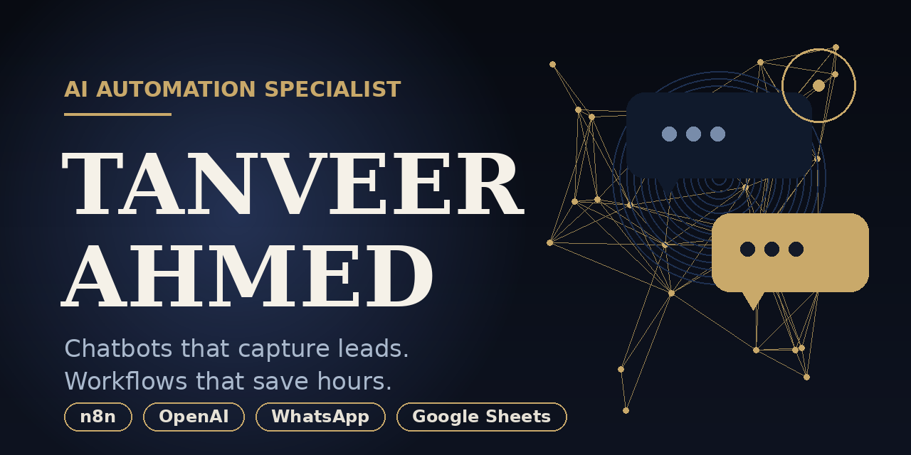

  

# Hi, I'm Tanveer Ahmed 👋

I'm a freelance developer focused on **AI chatbot development**, **n8n workflow automation**, and **lead capture systems for small businesses**.

## What I build

- **AI chatbots** for websites and WhatsApp that answer questions in real time and capture qualified leads
- **n8n workflow automations** that connect apps, sync data to Google Sheets/CRMs, and handle follow-ups, lead routing, and scheduled jobs
- **API integrations** that move data between tools automatically, including webhook receivers for real-time lead intake
- **Web scraping and data extraction** that turns publicly available web data into clean CSV/JSON, respecting robots.txt and rate limits
- **AI content pipelines** that draft blogs, product descriptions, and social posts on a schedule
- **Lead pipelines in Google Sheets** where every captured lead lands organized, deduped, and tracked, so nothing slips through the cracks

## Tech I work with

Python · JavaScript · n8n · OpenAI · Google Sheets · WhatsApp API · BeautifulSoup · FastAPI

## About the repos here

The repositories on this profile are **sample / demo builds** I created to demonstrate approaches and patterns. Not client work. They're starting points you can explore, adapt, and learn from.

📍 United States 
